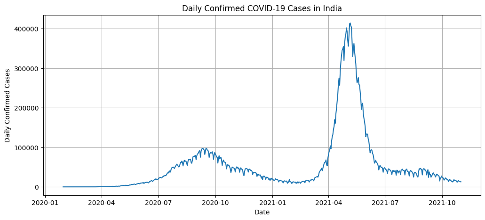
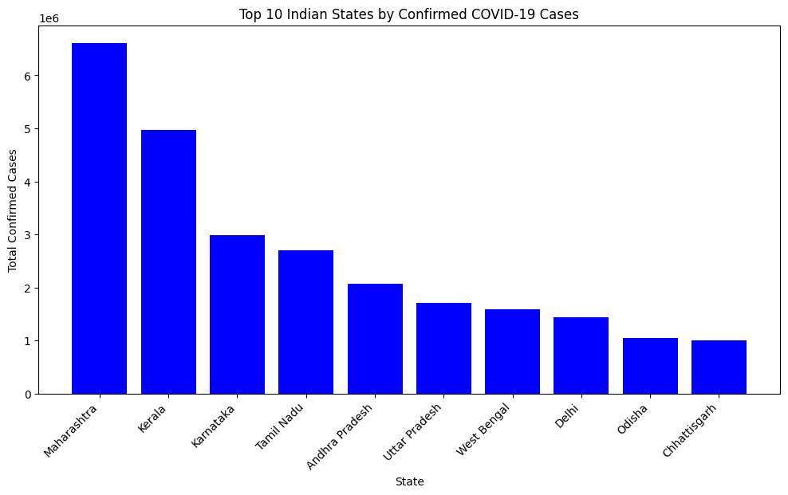

📊 COVID-19 India Analysis and Forecasting

A comprehensive epidemiological analytics project focused on COVID-19 spread, testing trends, healthcare capacity, and future case predictions in India. Built using real-world datasets and statistical modeling techniques.

🚀 Project Goals

Analyze national & state-level COVID-19 spread

Study testing growth and positivity trends

Evaluate healthcare capacity stress

Forecast future case trends using SARIMA

Present clear and actionable insights with visual reports

📂 Repository Structure
covid19-india-analysis-forecasting/
│
├── data/               # All datasets used in the project
├── notebooks/          # Jupyter/Colab analysis notebook
├── images/             # Exported charts & visuals
├── app/                # Streamlit dashboard (future work)
├── reports/            # Final report (optional)
└── README.md           # Project documentation

📈 Key Insights & Results
National Trend Analysis

Daily confirmed case patterns across all major waves

State-wise Epidemiological Findings

Maharashtra and Kerala recorded highest spread

Higher fatality in Delhi & Karnataka indicates healthcare stress

Testing Trend Observations

Testing capacity improved over time

Positivity spikes align with peak waves → insufficient testing

Healthcare Capacity Indicators

Cases per public hospital bed metric used

Bihar & UP showed severe resource pressure

Kerala & Karnataka handle burden better

Predictive Forecasting (SARIMA)

30-day forecast of daily confirmed cases

Useful for strategic preparedness & resource planning

🛠️ Tools & Technologies
Category	Tools
Language	Python
Analytics	Pandas, NumPy
Visualization	Matplotlib
Modeling	Statsmodels (SARIMAX)
Notebook	Google Colab / Jupyter
Deployment (future)	Streamlit
📊 Sample Visuals

📦 Data Sources

COVID-19 India Open Data Archives

ICMR Testing Details

Healthcare infrastructure statistics (Public beds data)

Links referenced inside notebook

🧠 What This Project Demonstrates

✔ Real-world epidemiology analytics
✔ Time-series forecasting skills
✔ Healthcare resource evaluation
✔ Actionable visual storytelling
✔ Full end-to-end data project execution

🚀 Future Enhancements

Interactive Streamlit dashboard UI

PDF report generation

State-wise forecasting models

Automated data refresh

👤 Author

N Kalyan Sai
B.Tech — Information Technology
Passionate about Data Analytics & AI

⭐ If you find this project useful, please consider giving a star on GitHub!
